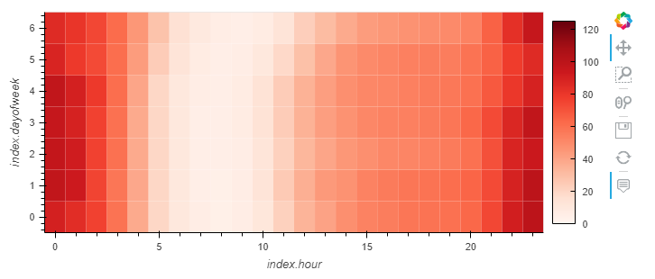

# Time-Series-Homework

*The Link to the Google Colab Notebook that contains all of my code can be accessed here:*

[Notebook](https://colab.research.google.com/drive/1hGwWsQIt3ZfAu3XaDD6_Hgu0P9xDJt6R#scrollTo=pt-JEuuIiGuE)
>
I will be doing a writeup including my findings and the relevant graphs/visualizations to answer questions below:
>
-Questions will be posed in bold
>
-Answers will be posed in italics

---

## Step 1: Find Unusual Patterns in Hourly Google Search Traffic

>
The above image shows the google search trends for MercadoLibre for the month of May 2020. The total searches for the month was 38,181, the median searches for each month of the year was 35,172.5. 

**Did the Google search traffic increase during the month that MercadoLibre released its financial results?**
>
*The google search traffic did increase the month that MercadoLibre released their financial results. There was a 8.53% increase in the number of searches if you compare the month of may to the median number of searches.*

---

## Step 2: Mine the Search Traffic Data for Seasonality

>
The above heatmap shows the search trends for MercardoLibre based off the hour as well as the day of the week.
>
**Does any day-of-week effect that you observe concentrate in just a few hours of that day?**
>
*It seems that despite the day of the week, the search trends look pretty much similar across all times of the day*
>

>
**Does the search traffic tend to increase during the winter holiday period (weeks 40 through 52)?**
>
*The search traffic does appear to have a sharp increase in the winter holiday period, followed by a steep drop off at the last week of the year*

---

## Step 3: Relate the Search Traffic to Stock Price Patterns

>
The above image shows both the search trends and closing value for Mercdo sliced at a timeframe during which the covid crisis occured. 
>
**Do both time series indicate a common trend that’s consistent with this narrative?**
>
*Both of these charts do confirm the narrative that sales dropped off during the covid crash and then increased back to higher levels after online sales began to become more popular, the drop off and subsequent increase can be seen in both search trends and closing price*
>

>
**Does a predictable relationship exist between the lagged search traffic and the stock volatility or between the lagged search traffic and the stock price returns?**
>
*The relationship between lagged search trends and stock volatility does have a somewhat predictable relationship with a negative correlation of -.1489. However, the relationship between lagged search traffic and stock price returns is very small and not very predictable.*

---

## Step 4: Create a Time Series Model with Prophet

>
**How's the near-term forecast for the popularity of MercadoLibre?**
>
*The near-term forecast for the popularity of MercadoLibre seems to be decreasing in the short-term**
>

>
**What time of day exhibits the greatest popularity?**
>
*It appears that midnight exhibits the greatest popularity, weening off until 6AM.*
>
**Which day of week gets the most search traffic?**
>
*Tuesday gets the most traffic out of any day*
>
**What's the lowest point for search traffic in the calendar year?**
>
*The lowest point for search traffic in the year appears to occur between september and november, so likely sometime in October*